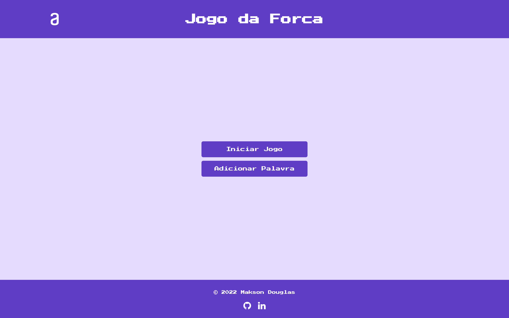
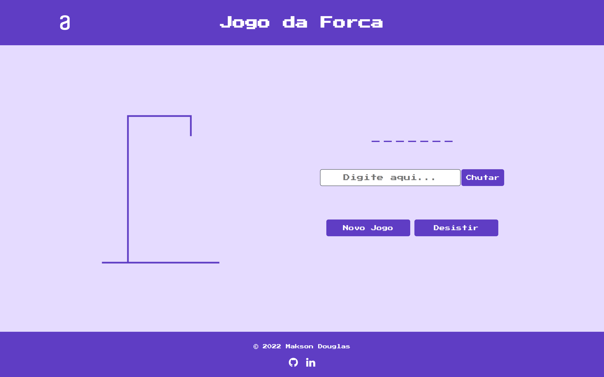
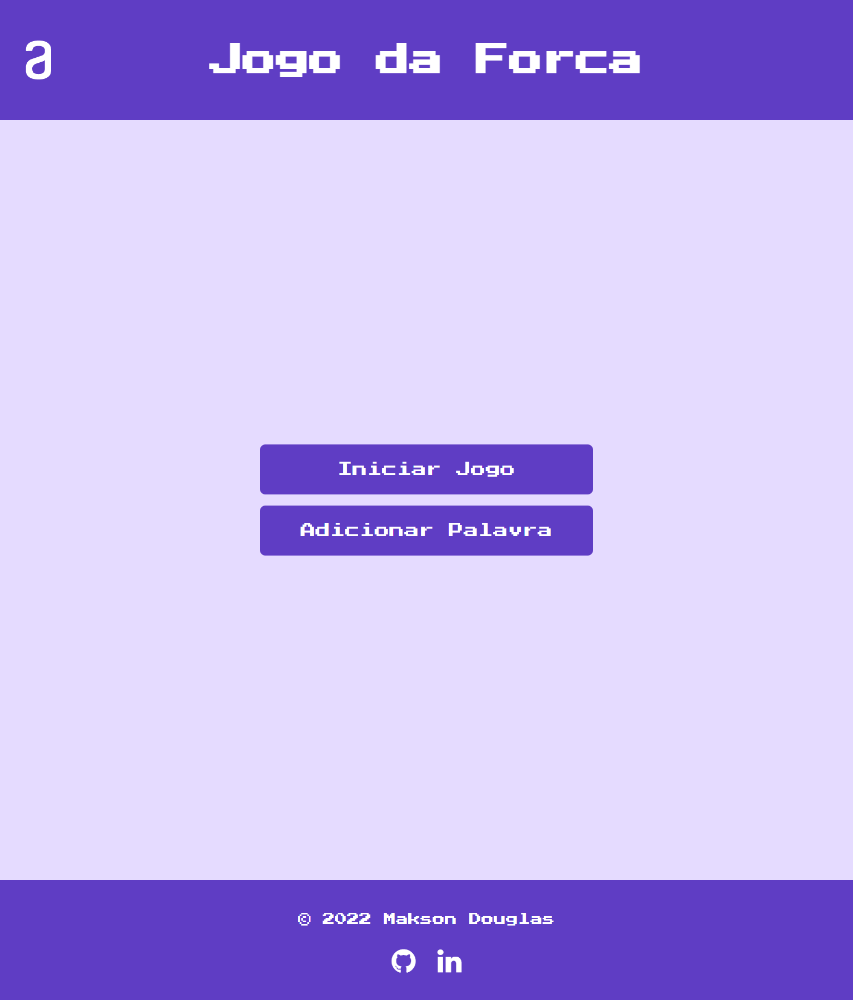
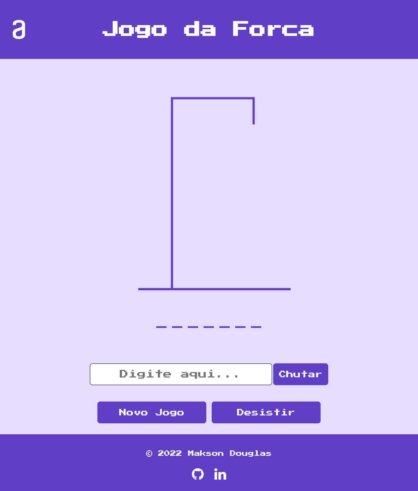
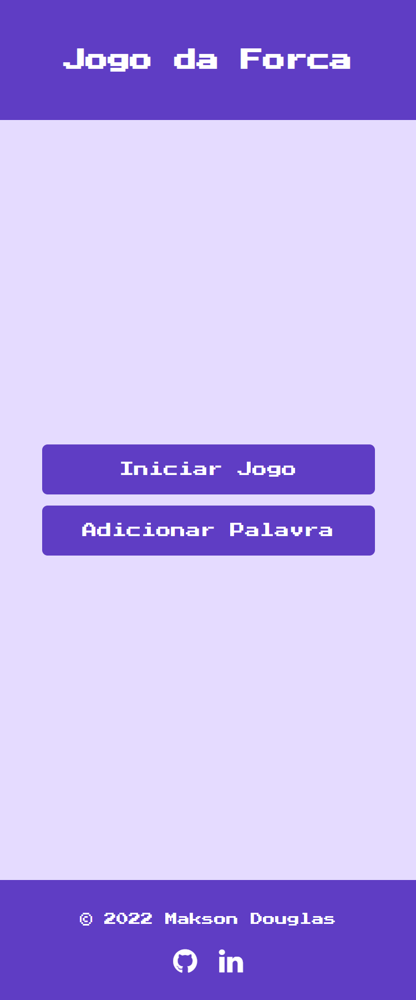
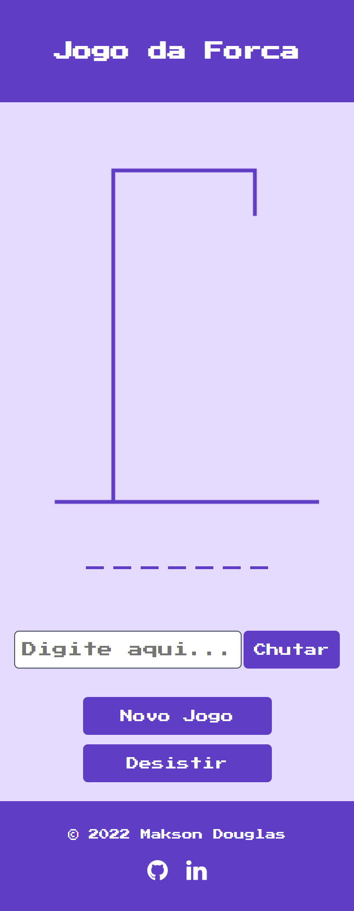

# JOGO DA FORCA

Este projeto é o 2º challenge proposto pelo programa [Oracle Next Education - ONE.](https://www.oracle.com/br/education/oracle-next-education/) Ele se trata de um jogo da forca.

## Tabela de Conteúdos

* [Visão Geral](#visao-geral)
  * [O Projeto](#o-projeto)
  * [Screenshot](#screenshot)
  * [Links](#links)
* [Tecnologias](#tecnologias)
* [Autor](#autor)
* [Licença](#licença)

## Visão Geral

### O Projeto

O projeto em questão se trata de um jogo da forca. Nele, os usuários serão capazes de:

 - Visualizar o layout ideal dependendo do tamanho de tela do dispositivo;
 - Ver os estados de foco para todos os elementos interativos na página.

### Screenshot 

#### Desktop

#### Tablet

#### Mobile

### Links

- Live Site URL: [Demo](https://makson19.github.io/jogo-da-forca/)

## Tecnologias

- HTML5
- CSS3
- JavaScript

## Autor

- Codepen - [@Makson19](https://codepen.io/Makson19)
- Frontend Mentor - [@Makson19](https://www.frontendmentor.io/profile/Makson19)
- Github - [Makson19](https://github.com/Makson19)
- LinkedIn - [Makson Douglas](https://www.linkedin.com/in/maksondouglas)

## Licença

- [MIT](./LICENSE)